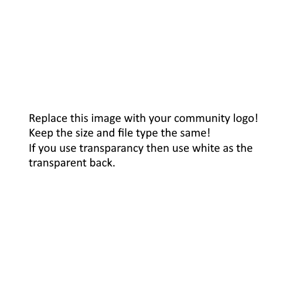

# Azure SQL Community

[](https://docs.microsoft.com/en-us/azure/azure-sql/)

Welcome to the Azure SQL Community! We are a global community of database professionals, developers, and enthusiasts passionate about Microsoft SQL Server and Azure SQL Database technologies.

## About Our Community

Our community focuses on:
- **Azure SQL Database** - Cloud-native database solutions
- **Azure SQL Managed Instance** - Fully managed SQL Server instances in the cloud  
- **SQL Server on Azure VMs** - Traditional SQL Server running on Azure virtual machines
- **Azure Synapse Analytics** - Enterprise data warehouse solutions
- **Database Migration** - Moving from on-premises to Azure
- **Performance Optimization** - Best practices for SQL performance in Azure
- **Security & Compliance** - Protecting your data in the cloud

## Sample SQL Code for Azure SQL Database

Here are some useful SQL scripts for Azure SQL Database management:

### Creating a Database with Backup Policy
```sql
-- Create a new Azure SQL Database
CREATE DATABASE MyAzureDB 
(
    EDITION = 'Standard',
    SERVICE_OBJECTIVE = 'S2',
    MAXSIZE = 250GB
);

-- Configure automated backups (built-in feature)
-- Point-in-time restore is automatically available for 7-35 days
```

### Connection String Example
```csharp
// C# connection string for Azure SQL Database
string connectionString = "Server=tcp:myserver.database.windows.net,1433;" +
                         "Initial Catalog=MyAzureDB;" +
                         "Persist Security Info=False;" +
                         "User ID=myusername;" +
                         "Password=mypassword;" +
                         "MultipleActiveResultSets=False;" +
                         "Encrypt=True;" +
                         "TrustServerCertificate=False;" +
                         "Connection Timeout=30;";
```

### Performance Monitoring Query
```sql
-- Monitor Azure SQL Database performance
SELECT 
    start_time,
    end_time,
    avg_cpu_percent,
    avg_data_io_percent,
    avg_log_write_percent,
    avg_memory_usage_percent,
    max_worker_percent,
    max_session_percent
FROM sys.dm_db_resource_stats
WHERE start_time >= DATEADD(hour, -1, GETDATE())
ORDER BY start_time DESC;
```

### Azure SQL Elastic Query Example
```sql
-- Create external data source for cross-database queries
CREATE EXTERNAL DATA SOURCE RemoteDB
WITH (
    TYPE = RDBMS,
    LOCATION = 'myserver.database.windows.net',
    DATABASE_NAME = 'RemoteDatabase',
    CREDENTIAL = MyCredential
);

-- Create external table
CREATE EXTERNAL TABLE RemoteTable (
    ID int,
    Name nvarchar(50),
    CreatedDate datetime2
)
WITH (
    DATA_SOURCE = RemoteDB,
    SCHEMA_NAME = 'dbo',
    OBJECT_NAME = 'SourceTable'
);
```

### Temporal Tables in Azure SQL
```sql
-- Create a temporal table for historical data tracking
CREATE TABLE Employee (
    EmployeeID int PRIMARY KEY CLUSTERED,
    Name nvarchar(100) NOT NULL,
    Position nvarchar(100) NOT NULL,
    Department nvarchar(100) NOT NULL,
    Address nvarchar(1024) NOT NULL,
    AnnualSalary decimal(10,2) NOT NULL,
    ValidFrom datetime2 GENERATED ALWAYS AS ROW START,
    ValidTo datetime2 GENERATED ALWAYS AS ROW END,
    PERIOD FOR SYSTEM_TIME (ValidFrom, ValidTo)
)
WITH (SYSTEM_VERSIONING = ON (HISTORY_TABLE = dbo.EmployeeHistory));
```

## Resources & Learning

- [Azure SQL Documentation](https://docs.microsoft.com/en-us/azure/azure-sql/)
- [SQL Server on Azure Virtual Machines](https://docs.microsoft.com/en-us/azure/azure-sql/virtual-machines/)
- [Azure Database Migration Guide](https://docs.microsoft.com/en-us/data-migration/)
- [Azure SQL Database Security](https://docs.microsoft.com/en-us/azure/azure-sql/database/security-overview)

## Join Our Events

We regularly organize:
- **Azure SQL Workshops** - Hands-on training sessions
- **Migration Bootcamps** - From on-premises to Azure
- **Performance Tuning Sessions** - Optimize your Azure SQL workloads
- **Security Deep Dives** - Protect your data in the cloud

[Follow us for event updates and announcements!](#)

## Community Organizers

If you have any questions, feedback, or want to contribute, please reach out to our community organizers:

* SQL Server Community [@SQLCommunity](https://twitter.com/SQLCommunity)
* Azure SQL Team [@AzureSQL](https://twitter.com/AzureSQL)
* Microsoft Data Platform [@MSDataPlatform](https://twitter.com/MSDataPlatform)

---

*Join us in building the future of cloud databases with Azure SQL!*